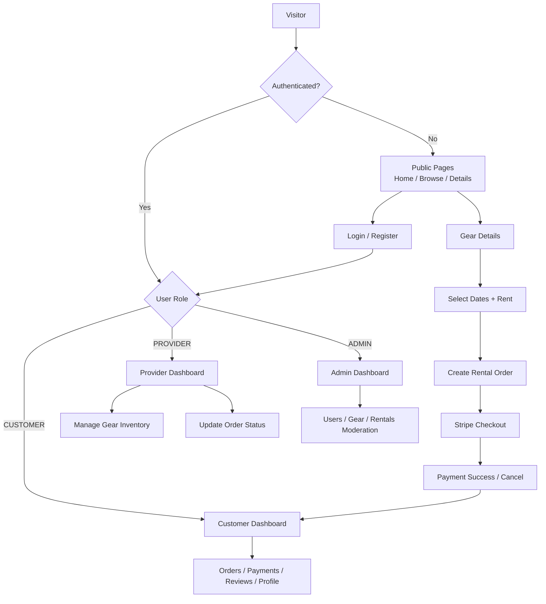

# GearUp 🏋️

**Rent Sports & Outdoor Gear Instantly**

A modern, full-stack sports and outdoor equipment rental platform. Customers browse gear, pick rental dates, and pay securely. Providers manage inventory and orders. Admins moderate the whole platform.

---

## Live Links

| Resource | Link |
|----------|------|
| **Live Frontend** | [https://gearupfronted.vercel.app](https://gearupfronted.vercel.app) |
| **Backend API** | [https://gareup.vercel.app](https://gareup.vercel.app) |
| **GitHub Monorepo** | [github.com/kaziashik/GearUp](https://github.com/kaziashik/GearUp) |
| **Frontend Code** | [`/Frontend`](./Frontend) |
| **Backend Code** | [`/Backand`](./Backand) |
| **API Integration Doc** | [`API_INTEGRATION.md`](./API_INTEGRATION.md) |

---

## Project Overview

GearUp is a modern, responsive **Next.js + Express** application for a sports and outdoor equipment rental service. Customers can browse available gear, select rental dates, and complete secure payments. Providers manage their gear inventory and fulfill rental orders through an intuitive dashboard. Admins oversee the entire platform through a comprehensive moderation interface.

> 💡 **Note:** This project includes both frontend and backend in one monorepo. The frontend consumes the GearUp REST API (local or deployed).

> ⚠️ **Note:** Treat the original assignment requirements as a strong guide. Features may be extended or adjusted to match a production-ready implementation strategy.

---

## Why This Project Was Created

### Problem Statement

Buying sports and outdoor gear is expensive, and owning equipment you only use a few times a year wastes money and storage. Local rental shops often have limited online catalogs, no real-time availability, and awkward booking/payment flows.

### Solution

GearUp connects:
- **Customers** who want temporary access to quality gear
- **Providers** who want to list and earn from their inventory
- **Admins** who keep the marketplace safe and organized

The goal is a clean, secure rental experience from browse → rent → pay → track → review.

---

## Features Available on the Website

### Public Features
- Responsive landing page with featured gear
- Browse gear grid with search, category, brand, price filters, sorting, and pagination
- Gear details page with image gallery, specs, provider info, and **Rent Now** flow
- Blog, Help, Contact, Privacy, and Terms pages
- Dark / light theme support

### Customer Features
- Register / Login (credentials + Google Sign-In)
- Role-based dashboard after login
- Place rental orders with date selection
- Stripe checkout payment flow
- Payment success / cancel pages
- Order history with status badges
- Pay / Cancel / Leave Review actions
- Profile update with optional image upload

### Provider Features
- Provider dashboard with inventory / order overview
- Add, edit, and manage gear listings
- Incoming order table with status updates (Confirm, Mark Picked Up, Mark Returned)

### Admin Features
- Global platform statistics and charts
- User management (search, suspend / activate)
- Content moderation for gear listings and rentals

### Platform / Security Features
- JWT access + refresh token authentication
- HttpOnly cookie-based session handling
- Next.js middleware route protection
- Role-based authorization (Customer / Provider / Admin)

---

## Roles & Permissions

| Role | Description | Frontend UI Expectations |
|------|-------------|--------------------------|
| **Customer** | Users who rent sports gear | Public browsing, interactive date pickers, checkout/payment flow, order tracking dashboard, review submission |
| **Provider** | Gear vendors / rental shops | Protected provider dashboard, gear CRUD forms (image upload UI), order management tables with status-update actions |
| **Admin** | Platform moderators | Protected admin dashboard, user management tables (suspend/activate), global statistics, content moderation UI |

---

## Walkthrough — How to Go Through the Project

### Customer Journey
```text
Register / Login
    → Browse Gear (/gear)
    → Open Gear Details (/gearDetails/[id])
    → Select Dates → Rent Now
    → Checkout / Stripe Payment
    → Payment Success Page
    → Track Order in Customer Dashboard
    → After Return → Leave Review
```

### Provider Journey
```text
Register as Provider / Login
    → Provider Dashboard
    → Add Gear
    → Manage Incoming Orders
    → Update Status (Confirm → Picked Up → Returned)
```

### Admin Journey
```text
Login as Admin
    → Admin Dashboard (stats)
    → Manage Users (suspend / activate)
    → Moderate Gear & Rentals
```

### Rental Order Status Badges
| Status | Meaning |
|--------|---------|
| `PLACED` | Order created (provider can Confirm) |
| `CONFIRMED` | Ready for payment |
| `PAID` | Payment completed |
| `PICKED_UP` | Customer has the gear |
| `RETURNED` | Gear returned (review available) |
| `CANCELLED` | Order cancelled |

---

## Tech Stack

### Frontend
| Area | Technology |
|------|------------|
| Framework | **Next.js 15** (App Router) |
| UI Library | **React 19** |
| Language | **TypeScript** |
| Styling | **Tailwind CSS** + CSS variables |
| Components | **Radix UI** + custom UI kit |
| Forms | **React Hook Form** + **Zod** |
| Charts / Graphs | **Recharts** |
| Animation | **Framer Motion** |
| Icons | **Lucide React** |
| Auth (Google) | **@react-oauth/google** |
| Theme | **next-themes** |
| Toasts | **Sonner** |
| Dates | **date-fns** / **react-day-picker** |
| Tokens | **jsonwebtoken** (verify/decode helpers) |

### Backend
| Area | Technology |
|------|------------|
| Runtime | **Node.js** |
| Framework | **Express 5** |
| Language | **TypeScript** |
| ORM | **Prisma 7** |
| Database | **PostgreSQL** |
| Auth | **JWT** + **bcryptjs** |
| Google Auth | **google-auth-library** |
| Payments | **Stripe** |
| Validation | **Zod** |
| CORS / Cookies | **cors**, **cookie-parser** |
| Deploy | **Vercel** (serverless) |

### Design System
- 3-color brand palette (primary / accent / secondary)
- Dark + light mode
- Responsive, mobile-first layouts
- Card-based product UI + dashboard tables/charts
- Soft motion with Framer Motion on key surfaces

---

## Project Flowchart



### High-level Architecture
```text
Browser (Next.js Frontend)
        |  cookies + fetch
        v
Express API (Backand)
        |
        +--> Prisma --> PostgreSQL
        +--> Stripe (payments)
        +--> Google OAuth (optional login)
```

---

## Folder Structure

### Monorepo Root
```text
GearUp/
├── Backand/              # Express + Prisma API
├── Frontend/             # Next.js application
├── API_INTEGRATION.md    # Frontend ↔ Backend API map
└── README.md
```

### Backend (`Backand/`)
```text
Backand/
├── api/                      # Vercel serverless entry
├── prisma/
│   ├── schema/               # Split Prisma models
│   ├── migrations/
│   └── seed.ts               # Demo data seeder
├── src/
│   ├── config/               # Env / app config
│   ├── lib/                  # prisma, stripe, googleAuth
│   ├── middlewares/          # auth, error, notFound
│   ├── modules/
│   │   ├── admin/
│   │   ├── auth/
│   │   ├── category/
│   │   ├── gear/
│   │   ├── payment/
│   │   ├── provider/
│   │   ├── rental/
│   │   ├── review/
│   │   └── users/
│   ├── utils/                # catchAsync, jwt, sendResponse
│   ├── app.ts
│   └── server.ts
├── package.json
├── tsconfig.json
└── vercel.json
```

### Frontend (`Frontend/`)
```text
Frontend/
├── app/
│   ├── (authGroup)/          # login, register, auth actions
│   ├── (publicGroup)/        # home, gear, details, blog, payment pages
│   ├── (dashboardGroup)/     # customer / provider / admin dashboards
│   └── api/                  # Next route handlers (proxy helpers)
├── components/
│   ├── charts/               # Recharts dashboard charts
│   ├── shared/               # Navbar, Footer, Theme, Google provider
│   └── ui/                   # Button, Card, Dialog, Select, etc.
├── hooks/
├── lib/                      # api helpers, types, design-system, utils
├── service/                  # getMe, logout, refreshToken
├── utils/                    # jwt helpers
├── middleware.ts             # Auth + role route protection
├── package.json
└── next.config.js
```

---

## Installation & Setup (Clear Instructions)

### Prerequisites
- Node.js 18+
- npm
- PostgreSQL database (local or hosted)
- Stripe test keys (for payments)
- Optional: Google OAuth Client ID

### 1) Clone the repository
```bash
git clone https://github.com/kaziashik/GearUp.git
cd GearUp
```

### 2) Setup Backend
```bash
cd Backand
npm install
cp .env.example .env
```

Fill `.env` with your values:
```env
DATABASE_URL=your_postgres_connection_string
JWT_ACCESS_SECRET=your_access_secret
JWT_REFRESH_SECRET=your_refresh_secret
JWT_ACCESS_EXPIRES_IN=15m
JWT_REFRESH_EXPIRES_IN=7d
STRIPE_SECRET_KEY=sk_test_xxx
STRIPE_WEBHOOK_SECRET=whsec_xxx
STRIPE_SUCCESS_URL=http://localhost:3000/payment/success
STRIPE_CANCEL_URL=http://localhost:3000/payment/cancel
CLIENT_URL=http://localhost:3000
GOOGLE_CLIENT_ID=your_google_client_id
PORT=5000
```

Then:
```bash
npx prisma generate
npx prisma db push
npm run db:seed
npm run dev
```

Backend runs at: **http://localhost:5000**

### 3) Setup Frontend
```bash
cd ../Frontend
npm install
cp .env.example .env.local
```

Fill `.env.local`:
```env
NEXT_PUBLIC_API_URL=http://localhost:5000
NEXT_PUBLIC_APP_URL=http://localhost:3000
NEXT_PUBLIC_GOOGLE_CLIENT_ID=your_google_client_id
JWT_ACCESS_SECRET=same_as_backend_access_secret
JWT_REFRESH_SECRET=same_as_backend_refresh_secret
```

Then:
```bash
npm run dev
```

Frontend runs at: **http://localhost:3000**

---

## Demo Accounts

| Role | Email | Password |
|------|-------|----------|
| Admin | `admin@gearup.com` | `Admin@123` |
| Provider | `provider@gearup.com` | `Provider@123` |
| Customer | `customer@gearup.com` | `Customer@123` |

---

## Key Frontend Routes

| Route | Feature |
|-------|---------|
| `/` | Home / featured gear |
| `/gear` | Browse + filter gear |
| `/gearDetails/[id]` | Details + rent CTA |
| `/login` / `/register` | Auth |
| `/customer-dashboard` | Customer overview & orders |
| `/customer-dashboard/orders/[id]/pay` | Payment initiation |
| `/payment/success` / `/payment/cancel` | Payment outcome |
| `/provider-dashboard` | Provider overview & inventory |
| `/admin-dashboard` | Admin overview & moderation |

---

## Packages Used (Summary)

### Frontend notable packages
`next`, `react`, `typescript`, `tailwindcss`, `framer-motion`, `recharts`, `lucide-react`, `@radix-ui/*`, `react-hook-form`, `zod`, `@react-oauth/google`, `sonner`, `next-themes`, `jsonwebtoken`

### Backend notable packages
`express`, `typescript`, `prisma`, `@prisma/client`, `pg`, `jsonwebtoken`, `bcryptjs`, `stripe`, `zod`, `cors`, `cookie-parser`, `google-auth-library`, `http-status`, `tsx`

---

## License

Educational / portfolio project. Use and adapt freely with attribution appreciated.
